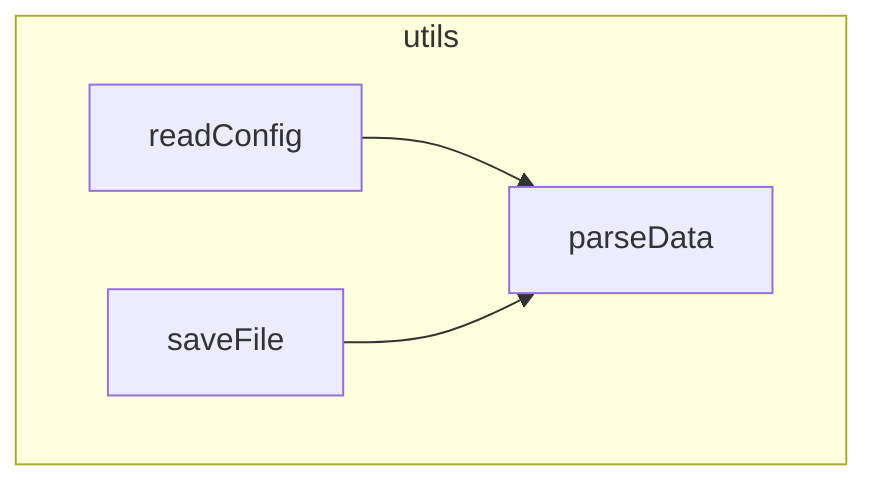

# fnmap

> AI code indexing tool for analyzing JS/TS code structure and generating structured code maps

[中文文档](./README_CN.md)

## Features

- 🚀 **Fast Analysis**: Quickly analyze JavaScript/TypeScript code structure using AST
- 📊 **Structured Output**: Generate `.fnmap` index files with imports, functions, classes, and constants
- 🔗 **Call Graph**: Track function call relationships and dependencies
- 📈 **Mermaid Diagrams**: Generate visual call graphs in Mermaid format
- 🎯 **Git Integration**: Process only changed files for efficient workflows
- ⚙️ **Flexible Configuration**: Support for multiple configuration methods
- 🔌 **Pre-commit Hook**: Integrate seamlessly with git hooks
- 📦 **Programmatic API**: Use as a library to process code strings directly
- 🎨 **Smart Filtering**: Automatically skip type definition files and type-only files
- 🌍 **Cross-Platform**: Normalized path handling for Windows, macOS, and Linux

## Installation

```bash
npm install -g @didnhdj/fnmap
```

Or use in your project:

```bash
npm install --save-dev @didnhdj/fnmap
```

## Quick Start

### Initialize Configuration

```bash
fnmap --init
```

This creates a `.fnmaprc` configuration file in your project root and automatically appends fnmap documentation to `CLAUDE.md` or `AGENTS.md` if they exist (useful for AI assistants).

### Basic Usage

```bash
# Process files based on configuration
fnmap

# Process specific directory
fnmap --dir src

# Process specific files
fnmap --files index.js,utils.js

# Process git changed files
fnmap --changed

# Process git staged files (for pre-commit hook)
fnmap --staged -q
```

### Generate Call Graphs

```bash
# Generate file-level Mermaid diagrams
fnmap --mermaid file --dir src

# Generate project-level Mermaid diagram
fnmap --mermaid project
```

## Configuration

fnmap supports multiple configuration methods (in priority order):

1. `.fnmaprc` - JSON configuration file
2. `.fnmaprc.json` - JSON configuration file
3. `package.json#fnmap` - fnmap field in package.json

### Configuration Example

**.fnmaprc**
```json
{
  "enable": true,
  "include": [
    "src/**/*.js",
    "src/**/*.ts",
    "src/**/*.jsx",
    "src/**/*.tsx"
  ],
  "exclude": [
    "node_modules",
    "dist",
    "build"
  ]
}
```

**package.json**
```json
{
  "fnmap": {
    "enable": true,
    "include": ["src/**/*.js", "src/**/*.ts"],
    "exclude": ["dist"]
  }
}
```

## Output Files

### .fnmap Index File

The `.fnmap` file contains structured information about your code:

```
@FNMAP src/
#utils.js Utility functions
  <fs:readFileSync,writeFileSync
  <path:join,resolve
  readConfig(filePath) 10-25 Read configuration file
  parseData(data) 27-40 Parse data →JSON.parse
  saveFile(path,content) 42-50 Save file →fs.writeFileSync,path.join
@FNMAP
```

**Format Description:**
- `#filename` - File name and description
- `<module:members` - Imported modules and members
- `functionName(params) startLine-endLine description →calls` - Function information with call graph
- `ClassName:SuperClass startLine-endLine` - Class information
- `  .methodName(params) line description →calls` - Instance method
- `  +methodName(params) line description →calls` - Static method
- `CONSTANT_NAME line description` - Constant definition

### Mermaid Call Graph

When using `--mermaid` option, generates visual call graphs:

**File-level** (`filename.mermaid`):


**Project-level** (`.fnmap.mermaid`):
Shows call relationships across all files in the project.

## CLI Options

```
Usage: fnmap [options] [files...]

Options:
  -v, --version          Show version number
  -f, --files <files>    Process specific files (comma-separated, generates separate .fnmap for each)
  -d, --dir <dir>        Process all code files in directory
  -p, --project <dir>    Specify project root directory (default: current directory)
  -c, --changed          Process git changed files (staged + modified + untracked)
  -s, --staged           Process git staged files (for pre-commit hook)
  -m, --mermaid [mode]   Generate Mermaid call graph (file=file-level, project=project-level)
  -q, --quiet            Quiet mode (suppress output)
  --init                 Create default configuration file and append docs to CLAUDE.md/AGENTS.md
  -h, --help             Display help information
```

## Programmatic API

fnmap can be used as a library in your Node.js applications.

### Processing Code Strings

```typescript
import { processCode } from '@didnhdj/fnmap';

const code = `
  export function hello(name) {
    console.log('Hello, ' + name);
  }
`;

const result = processCode(code, { filePath: 'example.js' });

if (result.success) {
  console.log('Functions:', result.info.functions);
  console.log('Imports:', result.info.imports);
  console.log('Call Graph:', result.info.callGraph);
} else {
  console.error('Parse error:', result.error);
}
```

### Processing Files

```typescript
import { processFile } from '@didnhdj/fnmap';

const result = processFile('./src/utils.js');

if (result.success) {
  console.log('Analysis result:', result.info);
}
```

### API Types

```typescript
// Process result type
type ProcessResult = ProcessSuccess | ProcessFailure;

interface ProcessSuccess {
  success: true;
  info: FileInfo;
}

interface ProcessFailure {
  success: false;
  error: string;
  errorType: ErrorType;
  loc?: { line: number; column: number };
}

// File info structure
interface FileInfo {
  imports: ImportInfo[];
  functions: FunctionInfo[];
  classes: ClassInfo[];
  constants: ConstantInfo[];
  callGraph: CallGraph;
  isPureTypeFile: boolean;  // Whether file only contains type definitions
}
```

## Use Cases

### 1. Pre-commit Hook

Add to `.husky/pre-commit` or `.git/hooks/pre-commit`:

```bash
#!/bin/sh
fnmap --staged -q
git add .fnmap
```

This automatically updates the `.fnmap` index when committing code.

### 2. CI/CD Integration

```yaml
# .github/workflows/ci.yml
- name: Generate Code Index
  run: |
    npm install -g @didnhdj/fnmap
    fnmap --dir src
    git diff --exit-code .fnmap || echo "Code index updated"
```

### 3. Code Review

```bash
# Generate index for changed files
fnmap --changed

# Generate call graph for review
fnmap --mermaid file --changed
```

### 4. Documentation Generation

```bash
# Generate project-level call graph
fnmap --mermaid project

# Use the .fnmap.mermaid file in your documentation
```

## Supported File Types

- `.js` - JavaScript
- `.ts` - TypeScript
- `.jsx` - React JSX
- `.tsx` - React TypeScript
- `.mjs` - ES Modules

**Auto-filtered files:**
- `.d.ts`, `.d.tsx`, `.d.mts` - Type definition files
- Files containing only `type` or `interface` declarations (pure type files)

## Limitations

To ensure performance and safety, fnmap has the following default limits:
- **File Size**: Maximum 10MB per file
- **Directory Depth**: Maximum recursion depth of 50 levels

## How It Works

1. **AST Parsing**: Uses `@babel/parser` to parse code into Abstract Syntax Tree
2. **Structure Analysis**: Traverses AST to extract imports, functions, classes, constants
3. **Call Graph**: Tracks function call relationships and dependencies
4. **Index Generation**: Generates compact `.fnmap` files with structured information
5. **Visualization**: Optionally generates Mermaid diagrams for visual representation

## Examples

### Example 1: Analyze Single File

```bash
fnmap --files src/utils.js
```

Output:
```
==================================================
fnmap - AI Code Indexing Tool
==================================================

Analyzing: src/utils.js
✓ Imports: 3, Functions: 5, Classes: 0, Constants: 2

Generating .fnmap index...
✓ src/utils.fnmap

==================================================
Complete! Analyzed: 1, Failed: 0
==================================================
```

### Example 2: Analyze Directory with Call Graph

```bash
fnmap --dir src --mermaid file
```

Generates:
- `src/.fnmap` - Code index
- `src/utils.mermaid` - Call graph for utils.js
- `src/parser.mermaid` - Call graph for parser.js
- etc.

### Example 3: Git Workflow

```bash
# Make changes to code
git add .

# Generate index for staged files
fnmap --staged -q

# Add updated index
git add .fnmap

# Commit
git commit -m "Update feature"
```

## Contributing

Contributions are welcome! Please feel free to submit a Pull Request.

## License

MIT

## Related Projects

- [@babel/parser](https://babeljs.io/docs/en/babel-parser) - JavaScript parser
- [@babel/traverse](https://babeljs.io/docs/en/babel-traverse) - AST traversal
- [Mermaid](https://mermaid-js.github.io/) - Diagram generation

## Support

- 🐛 [Report Issues](https://github.com/gqfx/fnmap/issues)
- 💡 [Feature Requests](https://github.com/gqfx/fnmap/issues)
- 📖 [Documentation](https://github.com/gqfx/fnmap)
