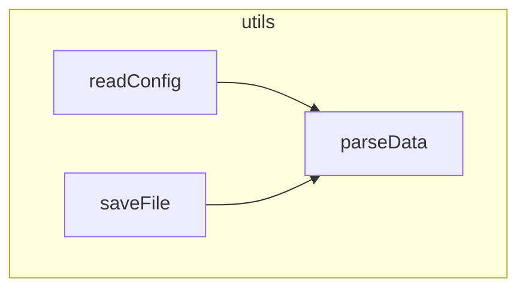

# fnmap

[](https://www.npmjs.com/package/@didnhdj/fnmap)
[](https://www.npmjs.com/package/@didnhdj/fnmap)

> AI 代码索引生成工具，分析 JS/TS 代码结构，生成结构化代码映射

[English Documentation](./README.md)

## 特性

- 🚀 **快速分析**：使用 AST 快速分析 JavaScript/TypeScript 代码结构
- 📊 **结构化输出**：生成包含导入、函数、类、常量的 `.fnmap` 索引文件
- 🔗 **调用图谱**：追踪函数调用关系和依赖
- 📈 **Mermaid 图表**：生成 Mermaid 格式的可视化调用图
- 🎯 **Git 集成**：只处理改动的文件，提高工作效率
- ⚙️ **灵活配置**：支持多种配置方式
- 🔌 **Pre-commit Hook**：无缝集成 git hooks
- 📦 **编程接口**：可作为库直接处理代码字符串
- 🎨 **智能过滤**：自动跳过类型定义文件和纯类型文件
- 🌍 **跨平台支持**：支持 Windows、macOS 和 Linux 的路径规范化

## 安装

```bash
npm install -g @didnhdj/fnmap
```

或在项目中使用：

```bash
npm install --save-dev @didnhdj/fnmap
```

## 快速开始

### 初始化配置

```bash
fnmap --init
```

这会在项目根目录创建 `.fnmaprc` 配置文件，并自动追加 fnmap 文档到 `CLAUDE.md` 或 `AGENTS.md`（如果存在，方便 AI 助手理解）。

### 基本用法

```bash
# 根据配置文件处理
fnmap

# 处理指定目录
fnmap --dir src

# 处理指定文件
fnmap --files index.js,utils.js

# 处理 git 改动的文件
fnmap --changed

# 处理 git staged 文件（用于 pre-commit hook）
fnmap --staged -q
```

### 生成调用图

```bash
# 生成文件级 Mermaid 图表
fnmap --mermaid file --dir src

# 生成项目级 Mermaid 图表
fnmap --mermaid project
```

## 配置

fnmap 支持多种配置方式（按优先级排序）：

1. `.fnmaprc` - JSON 配置文件
2. `.fnmaprc.json` - JSON 配置文件
3. `package.json#fnmap` - package.json 中的 fnmap 字段

### 配置示例

**.fnmaprc**
```json
{
  "enable": true,
  "include": [
    "src/**/*.js",
    "src/**/*.ts",
    "src/**/*.jsx",
    "src/**/*.tsx"
  ],
  "exclude": [
    "node_modules",
    "dist",
    "build"
  ]
}
```

**package.json**
```json
{
  "fnmap": {
    "enable": true,
    "include": ["src/**/*.js", "src/**/*.ts"],
    "exclude": ["dist"]
  }
}
```

## 输出文件

### .fnmap 索引文件

`.fnmap` 文件包含代码的结构化信息：

```
@FNMAP src/
#utils.js 工具函数
  <fs:readFileSync,writeFileSync
  <path:join,resolve
  readConfig(filePath) 10-25 读取配置文件
  parseData(data) 27-40 解析数据 →JSON.parse
  saveFile(path,content) 42-50 保存文件 →fs.writeFileSync,path.join
@FNMAP
```

**格式说明：**
- `#filename` - 文件名和描述
- `<module:members` - 导入的模块和成员
- `functionName(params) startLine-endLine description →calls` - 函数信息及调用图
- `ClassName:SuperClass startLine-endLine` - 类信息
- `  .methodName(params) line description →calls` - 实例方法
- `  +methodName(params) line description →calls` - 静态方法
- `CONSTANT_NAME line description` - 常量定义

### Mermaid 调用图

使用 `--mermaid` 选项时，生成可视化调用图：

**文件级** (`filename.mermaid`)：


**项目级** (`.fnmap.mermaid`)：
显示项目中所有文件的调用关系。

## CLI 选项

```
用法: fnmap [options] [files...]

选项:
  -v, --version          显示版本号
  -f, --files <files>    处理指定文件（逗号分隔，为每个文件生成单独的 .fnmap）
  -d, --dir <dir>        处理目录下所有代码文件
  -p, --project <dir>    指定项目根目录（默认：当前目录）
  -c, --changed          处理 git 改动的文件（staged + modified + untracked）
  -s, --staged           处理 git staged 文件（用于 pre-commit hook）
  -m, --mermaid [mode]   生成 Mermaid 调用图（file=文件级，project=项目级）
  -q, --quiet            静默模式（不输出信息）
  --init                 创建默认配置文件并追加文档到 CLAUDE.md/AGENTS.md
  -h, --help             显示帮助信息
```

## 编程接口

fnmap 可以作为库在 Node.js 应用中使用。

### 处理代码字符串

```typescript
import { processCode } from '@didnhdj/fnmap';

const code = `
  export function hello(name) {
    console.log('Hello, ' + name);
  }
`;

const result = processCode(code, { filePath: 'example.js' });

if (result.success) {
  console.log('函数:', result.info.functions);
  console.log('导入:', result.info.imports);
  console.log('调用图:', result.info.callGraph);
} else {
  console.error('解析错误:', result.error);
}
```

### 处理文件

```typescript
import { processFile } from '@didnhdj/fnmap';

const result = processFile('./src/utils.js');

if (result.success) {
  console.log('分析结果:', result.info);
}
```

### API 类型定义

```typescript
// 处理结果类型
type ProcessResult = ProcessSuccess | ProcessFailure;

interface ProcessSuccess {
  success: true;
  info: FileInfo;
}

interface ProcessFailure {
  success: false;
  error: string;
  errorType: ErrorType;
  loc?: { line: number; column: number };
}

// 文件信息结构
interface FileInfo {
  imports: ImportInfo[];
  functions: FunctionInfo[];
  classes: ClassInfo[];
  constants: ConstantInfo[];
  callGraph: CallGraph;
  isPureTypeFile: boolean;  // 文件是否仅包含类型定义
}
```

## 使用场景

### 1. Pre-commit Hook

添加到 `.husky/pre-commit` 或 `.git/hooks/pre-commit`：

```bash
#!/bin/sh
fnmap --staged -q
git add .fnmap
```

这样在提交代码时会自动更新 `.fnmap` 索引。

### 2. CI/CD 集成

```yaml
# .github/workflows/ci.yml
- name: Generate Code Index
  run: |
    npm install -g @didnhdj/fnmap
    fnmap --dir src
    git diff --exit-code .fnmap || echo "Code index updated"
```

### 3. 代码审查

```bash
# 为改动的文件生成索引
fnmap --changed

# 生成调用图用于审查
fnmap --mermaid file --changed
```

### 4. 文档生成

```bash
# 生成项目级调用图
fnmap --mermaid project

# 在文档中使用 .fnmap.mermaid 文件
```

## 支持的文件类型

- `.js` - JavaScript
- `.ts` - TypeScript
- `.jsx` - React JSX
- `.tsx` - React TypeScript
- `.mjs` - ES Modules

**自动过滤的文件：**
- `.d.ts`、`.d.tsx`、`.d.mts` - 类型定义文件
- 仅包含 `type` 或 `interface` 声明的纯类型文件

## 限制

为了保证性能和安全，fnmap 有以下默认限制：
- **文件大小**：单个文件最大支持 10MB
- **目录深度**：最大递归深度为 50 层

## 工作原理

1. **AST 解析**：使用 `@babel/parser` 将代码解析为抽象语法树
2. **结构分析**：遍历 AST 提取导入、函数、类、常量
3. **调用图谱**：追踪函数调用关系和依赖
4. **索引生成**：生成紧凑的 `.fnmap` 文件，包含结构化信息
5. **可视化**：可选生成 Mermaid 图表进行可视化展示

## 示例

### 示例 1：分析单个文件

```bash
fnmap --files src/utils.js
```

输出：
```
==================================================
fnmap - AI 代码索引生成工具
==================================================

Analyzing: src/utils.js
✓ Imports: 3, Functions: 5, Classes: 0, Constants: 2

Generating .fnmap index...
✓ src/utils.fnmap

==================================================
Complete! Analyzed: 1, Failed: 0
==================================================
```

### 示例 2：分析目录并生成调用图

```bash
fnmap --dir src --mermaid file
```

生成：
- `src/.fnmap` - 代码索引
- `src/utils.mermaid` - utils.js 的调用图
- `src/parser.mermaid` - parser.js 的调用图
- 等等

### 示例 3：Git 工作流

```bash
# 修改代码
git add .

# 为 staged 文件生成索引
fnmap --staged -q

# 添加更新的索引
git add .fnmap

# 提交
git commit -m "Update feature"
```

## 贡献

欢迎贡献！请随时提交 Pull Request。

## 许可证

MIT

## 相关项目

- [@babel/parser](https://babeljs.io/docs/en/babel-parser) - JavaScript 解析器
- [@babel/traverse](https://babeljs.io/docs/en/babel-traverse) - AST 遍历
- [Mermaid](https://mermaid-js.github.io/) - 图表生成

## 支持

- 🐛 [报告问题](https://github.com/gqfx/fnmap/issues)
- 💡 [功能请求](https://github.com/gqfx/fnmap/issues)
- 📖 [文档](https://github.com/gqfx/fnmap)
